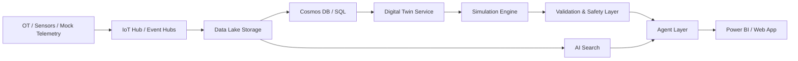
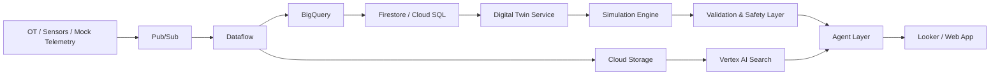

# System Architecture for Autonomous Manufacturing

## Overview

This document summarizes the full architecture for the autonomous manufacturing system. It combines the multi-agent maintenance copilot, the digital twin, and the cloud implementation options for Azure and GCP.

The system is designed to support autonomous maintenance in a safe, operator-in-the-loop way.

## Major Building Blocks

### 1. Agent Layer
The agent layer provides reasoning, retrieval, and instruction generation.

Agents:
- Signal agent
- Asset-context agent
- Knowledge agent
- Root-cause agent
- Work-instruction agent

Responsibilities:
- detect anomalies
- gather asset context
- retrieve manuals and procedures
- rank likely causes
- draft safe maintenance steps

### 2. Digital Twin Layer
The digital twin layer models the asset and simulates behavior.

Responsibilities:
- represent asset state
- ingest telemetry
- track degradation
- simulate what-if scenarios
- validate interventions
- provide evidence to agents

### 3. Data Layer
The data layer stores raw and curated information.

Contents:
- telemetry
- alarms
- manuals
- asset metadata
- maintenance logs
- scenario results

### 4. Cloud Layer
The cloud layer hosts the ingestion, storage, AI, and runtime services.

It can be deployed on either:
- Azure
- GCP

## End-to-End Data Flow

### Step 1: Telemetry ingestion
Telemetry arrives from sensors, mock generators, or read-only OT connectors.

### Step 2: Data normalization
Streaming services clean, enrich, and route the data.

### Step 3: Storage
Raw data is stored in object storage or data lake services. Structured metadata and live twin state are stored in databases.

### Step 4: Twin state update
The digital twin updates the current asset state and fault progression.

### Step 5: Agent reasoning
The agents retrieve context, inspect evidence, and reason about likely causes.

### Step 6: Simulation and validation
The twin runs what-if scenarios and checks whether candidate interventions make sense.

### Step 7: Instruction generation
The work-instruction agent drafts safe operator guidance.

### Step 8: Operator review
The operator reviews recommendations before any action is taken.

## Azure Reference Architecture

### Ingestion
- Azure IoT Hub
- Azure Event Hubs
- Azure Data Factory

### Storage
- Azure Data Lake Storage Gen2
- Azure Cosmos DB
- Azure SQL Database or PostgreSQL

### AI and Agents
- Azure OpenAI Service
- Azure AI Search
- Azure Functions or Container Apps
- AKS for long-running services

### Simulation
- AKS or Container Apps for the twin engine
- Azure Machine Learning for predictive models

### Visualization
- Power BI
- custom web app on Azure App Service

## GCP Reference Architecture

### Ingestion
- Pub/Sub
- Dataflow
- Cloud Run jobs

### Storage
- Cloud Storage
- BigQuery
- Firestore or Cloud SQL

### AI and Agents
- Gemini via Vertex AI
- Vertex AI Search
- ADK for agent orchestration
- Cloud Run or GKE for services

### Simulation
- Cloud Run or GKE for the twin engine
- Vertex AI for predictive models

### Visualization
- Looker
- custom web app on Cloud Run or Firebase Hosting

## Azure Data Flow

## GCP Data Flow

## Core Design Principles

- keep OT connectivity read-only
- keep the operator in control
- separate reasoning from simulation
- keep the twin explainable
- prefer a small MVP first
- use cloud services to accelerate, not complicate

## Recommended MVP

The first version should include:
- one asset
- a few key sensors
- one failure mode library
- one knowledge source
- one simulation scenario
- one operator UI

## Summary

The system works best when the agents and digital twin are separated but tightly connected.

- The **agents** reason, retrieve, explain, and draft instructions.
- The **digital twin** models state, simulates outcomes, and validates actions.
- The **cloud platform** hosts ingestion, storage, AI, and runtime services.

This separation keeps the design clear and makes it easier to implement on either Azure or GCP.
